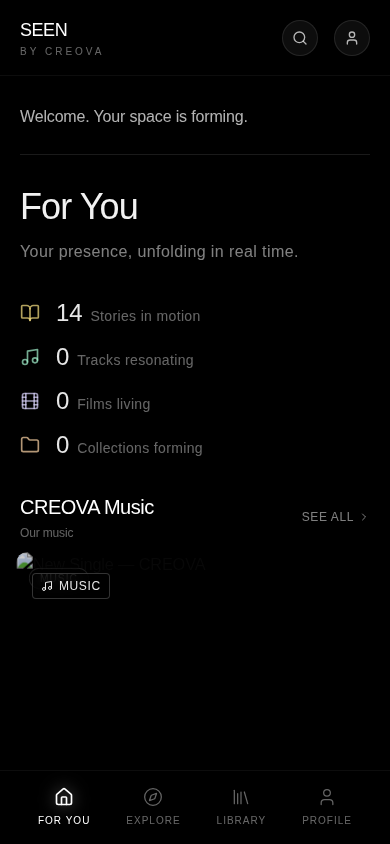

# SEEN

**An interactive digital storytelling platform delivering immersive, multilingual story worlds through audio and film — CREOVA's flagship digital product.**


## What this is

SEEN is CREOVA's interactive storytelling platform — readers move through branching narrative "story worlds" delivered as audio and film content, in English, French, and Spanish. It's built for depth over distraction: intentional engagement and reflection rather than passive scrolling, while giving creators a way to share authentic, culturally grounded narratives. The codebase spans a web app (story builder, content library, navigation flow tooling) and a mobile companion app (chapters, explore, create, moderate, admin).



**Try it live:** [replit.com/@ayoubjustin2/SEEN](https://replit.com/@ayoubjustin2/SEEN)

## Status: In active development

This is the most feature-complete prototype in the CREOVA portfolio (100+ custom screens/components across web and mobile). Institutional partnerships (universities, school boards, cultural organizations) are the near-term go-to-market target rather than direct consumer subscriptions.

### Roadmap
- Institutional pilot partnerships (universities, school boards)
- Content moderation review ahead of any creator-submitted content going live
- Backend wiring for user-generated story content at scale

## Quickstart

```bash
npm i
npm run dev          # web
# for mobile (Expo):
cd mobile && npm i && npm start
```

## Folder overview

- `src/app/components/` — web app screens (story builder, library, navigation flow)
- `mobile/` — Expo companion app (chapters, explore, create, moderate)

## Contributing

See the [org-wide CONTRIBUTING.md](https://github.com/creova-gif/.github/blob/main/CONTRIBUTING.md) for guidelines, including our AI-assisted contribution policy.

## License

Proprietary — © CREOVA. All rights reserved.
