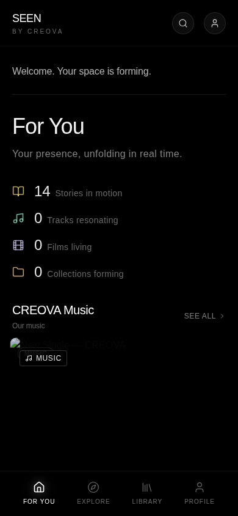

# SEEN

**An interactive digital storytelling platform delivering immersive, multilingual story worlds through audio and film — CREOVA's flagship digital product.**




**Try it live:** [replit.com/@ayoubjustin2/SEEN](https://replit.com/@ayoubjustin2/SEEN)

## Overview

An interactive storytelling platform where readers move through branching narrative "story worlds" delivered as audio and film content, in English, French, and Spanish.

## Problem

Most digital storytelling is either passive video/audio consumption or shallow "choose your own adventure" gimmicks — neither leaves room for culturally grounded, reflective narrative from creators outside mainstream media.

## Solution

Branching story worlds built for depth over distraction, with real tooling for creators (story builder, content library, navigation flow) rather than a fixed content catalog.

## Key Capabilities

- Branching narrative playback across audio and film
- Multilingual (English, French, Spanish)
- Story builder and content library for creators
- Mobile companion app: chapters, explore, create, moderate, admin

## Architecture

Web app (React) plus an Expo mobile companion app. This is the most feature-complete prototype in the portfolio — 100+ custom screens/components across web and mobile.

## Technology Stack

| Layer | Technology |
|---|---|
| Web | React |
| Mobile | Expo (React Native) |

## Repository Structure

- `src/app/components/` — web app screens (story builder, library, navigation flow)
- `mobile/` — Expo companion app (chapters, explore, create, moderate)

## Getting Started

```bash
npm i
npm run dev          # web
cd mobile && npm i && npm start   # mobile
```

## Project Status

Active development, feature-complete prototype. Institutional partnerships (universities, school boards, cultural organizations) are the near-term go-to-market target rather than direct consumer subscriptions.

## Roadmap

- [ ] Institutional pilot partnerships
- [ ] Content moderation review ahead of creator-submitted content going live
- [ ] Backend wiring for user-generated story content at scale

## Contributing

See the [org-wide CONTRIBUTING.md](https://github.com/creova-gif/.github/blob/main/CONTRIBUTING.md).

## License

Proprietary — © CREOVA. All rights reserved.

## Author / Organization

Built by [Justin Mafie](https://github.com/creova-gif) under CREOVA.
